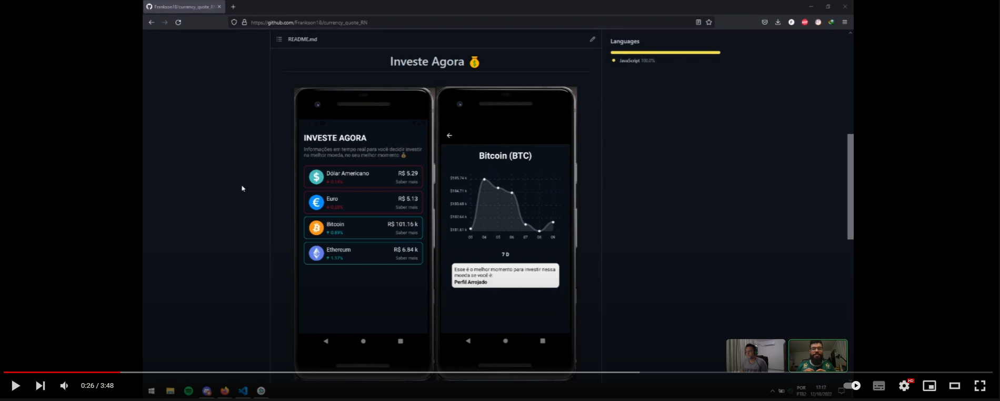

<h1 align="center">Investe Agora 💰</h1>

 

   

 
 

O aplicativo na sua primeira versão tem como objetivo de informar para o usuário dados em tempo real dos valores da cotação de cada moeda de paises internacionais assim como de crypto moedas para o câmbio brasileiro.

O aplicativo é composto atualmente por três telas, a primeira tela sendo o login com o google.

A segunda possui os cards contendo os nomes das moedas, valor em Real, a variação dos valores nos ultimos 7 dias e um botão para favoritar sua moeda conectado com o firebase, assim mesmo que feche o app, seus favoritos ficaram salvos. 

A terceira tela é composta por um gráfico mostrando essa variação da moeda e informando
para o usuário uma dica para possivel investimento.

## Novas Features 🛠️

* Adicionar mais opções de moedas
* Adicionar um intervalo maior do histórico de câmbio das moedas
* Adicionar um novo calculo de dicas
* Adiconar novos cards contendo noticias sobre o mercado financeiro
* Adicionar anuncios
* Adicionar na lojas para download

## Novas Features Técnicas 🛠️

* Melhorar a qualidade do código
* Melhorar layout

## Em estudo 📚

* Desenvolver aplicativo web

## Tech 💻

* [React Native](https://reactnative.dev/)
* [API Moedas](https://docs.awesomeapi.com.br/api-de-moedas)
* [Chart](https://github.com/indiespirit/react-native-chart-kit)

## Autores

- [Frankson Souza](https://github.com/Frankson18) 
- [Tiago Oliveira](https://www.linkedin.com/in/tiagolivesan/)

## Overview

